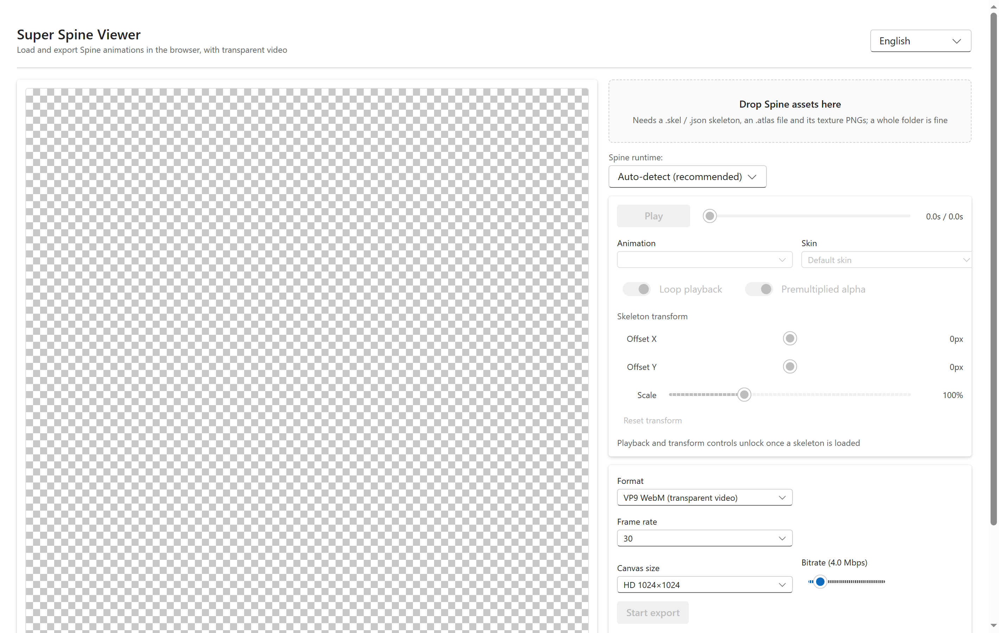
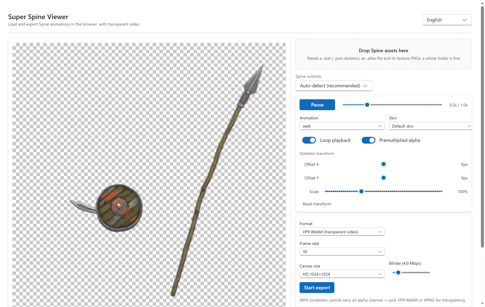
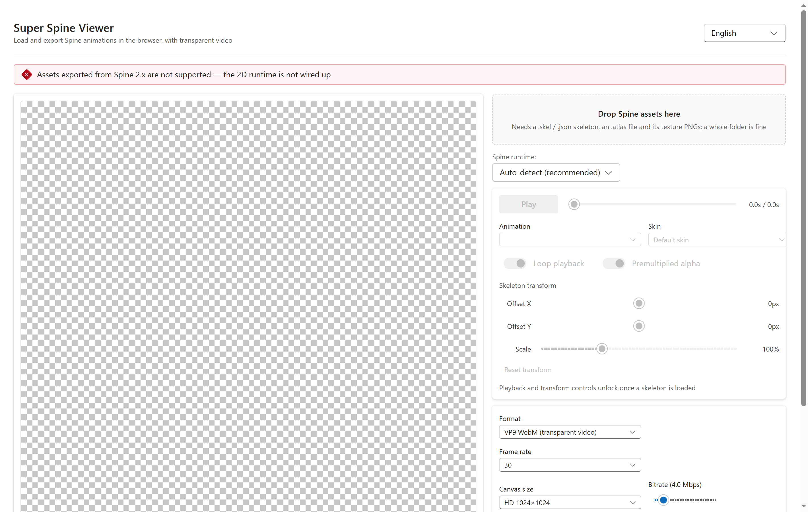

# SuperSpineViewer — User Guide

[中文说明](README.md) | [Source code](https://github.com/Aloento/SuperSpineViewer)

A **tool that runs in your web browser**, made to open **Spine animations** and export them as
**videos or image sequences with a transparent background**.

No installation, no account, and your files never leave your computer — everything happens locally.

- Open it here: <https://ssv.aloen.to/>
  (if that address ever fails to load, check the
  [GitHub repository](https://github.com/Aloento/SuperSpineViewer) for the current link)
- Best browser: **desktop Edge or Chrome** (needed for transparent video export)
- The interface switches between Chinese and English automatically, following your system language

---

## 1. Three steps

**Step 1** — open <https://ssv.aloen.to/>

**Step 2** — drag your animation files into the dashed box on the left (see section 2)

**Step 3** — the animation starts on its own. On the right you can change speed, action and skin,
then press "Start export"

Once an animation loads, you get a preview on the left and the controls on the right:

---

## 2. ⚠️ The one thing you must know: **you need all three files at once**

This is the most common mistake. **One file alone will not load** — you have to provide all three:

| | What you need | File name looks like | Notes |
| --- | --- | --- | --- |
| 1 | **Skeleton file** | `goblins-mesh.json` or `goblins-mesh.skel` | The animation data. **Give one of the two**, not both |
| 2 | **Atlas file** | `goblins-mesh.atlas` | Tells the app where each sprite sits in the big image. Must be `.atlas` |
| 3 | **Texture images** | `goblins-mesh.png` | The actual artwork. **One animation may use several images — include them all** |

### ✅ The easy way (strongly recommended)

**Put all three kinds of files in one folder, then drag the whole folder into the dashed box.**

The app figures out which file is which, so you don't have to care about names.
They don't have to match exactly either — `spineboy.json` next to `spineboy-pma.atlas` works fine.

### You can also pick files one by one

Click the button in the dashed box and choose the skeleton (`.json` or `.skel`), then the atlas
(`.atlas`) and the images (`.png`). If something is missing, a red banner at the top of the page
tells you exactly what.

---

## 3. Frequently asked questions

**Q: Nothing happened after I dropped the files / it says "skeleton file not found"?**
The files you dropped contain no skeleton (`.json` or `.skel`). Make sure these are **files exported
from Spine**, not a Photoshop / Premiere / After Effects project.

**Q: It says "texture missing: xxx.png"?**
One of the images the animation needs wasn't included. Find that image and drop everything again.

**Q: It says Spine 2.x is not supported?**
Resources exported by Spine 2.x (from around 2015) cannot be opened. Everything from 3.0 to 4.3 works.

**Q: It says a newer Spine version is not supported yet?**
Those files were exported by something newer than Spine 4.3, which isn't supported yet.

**Q: The exported video background isn't transparent?**
Pick **VP9 WebM (transparent video)** or **APNG frame sequence (ZIP)** in the export panel.
MP4 cannot store transparency, so this tool does not export MP4.

**Q: The export button is greyed out?**
Make sure the animation is actually playing first (you should see "Playing" on the left);
the export button only becomes active then.

**Q: The animation plays but it's off-centre or too big?**
Use the Offset X / Offset Y / Scale sliders under "Skeleton transform" on the right.
The exported size follows what you chose in the export panel, not the window size.

**Q: My extracted files have messy names, which one do I need?**
Just drag the whole folder. Suffixes like `-pma`, `-pro`, `-ess`, `.txt` and `.bytes` are
recognised automatically.

---

## 4. Works offline

Once you have opened the page once while online, you can keep loading and exporting **with no
network at all**. You can also add it to your phone home screen from the browser menu.

---

## 5. Can't find the right files?

Spine resources usually come out of unpacked game archives. This tool only **opens and exports**
them — it does not unpack anything. If you have a folder full of unfamiliar files, try dropping
the whole folder in first, as described in section 2.

## 6. Want to know more

- Source code, bug reports, and stars welcome: <https://github.com/Aloento/SuperSpineViewer>
- Author: **[Aloento](https://aloen.to/)**
- If you want to change the code, run the tests or read the architecture, see the
  [technical manual](docs/DEVELOPMENT.md)
