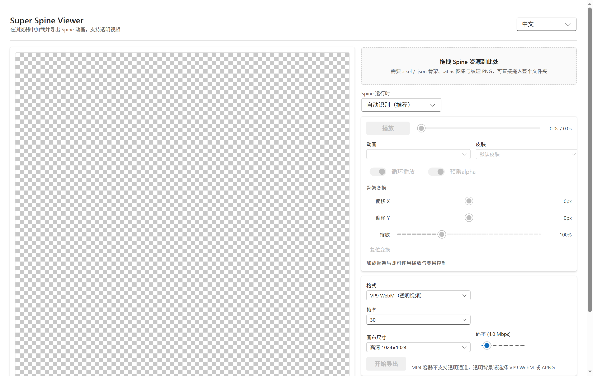
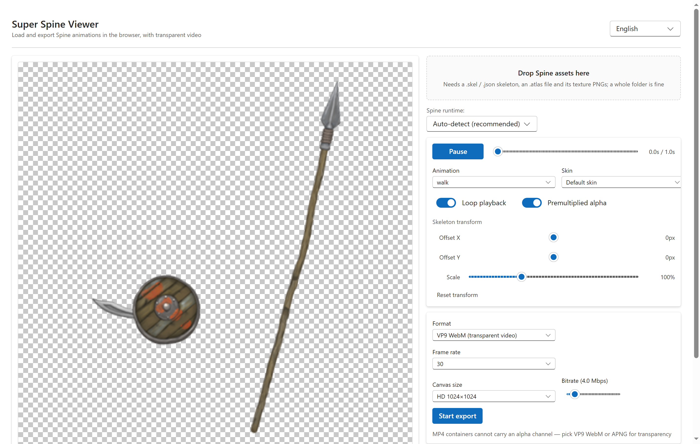
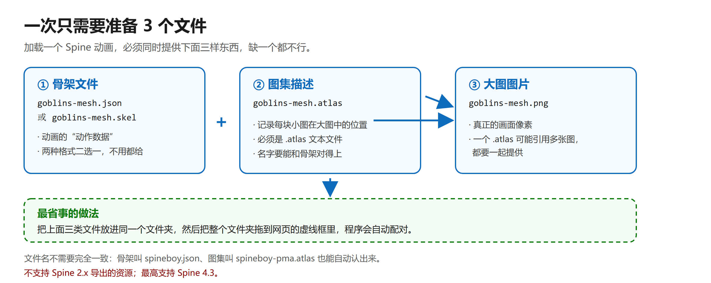

# SuperSpineViewer 使用说明

[English guide](README-Eng.md) ｜ [项目代码仓库](https://github.com/Aloento/SuperSpineViewer)

这是一个**在网页里打开就能用的动画工具**，专门用来打开 **Spine 动画**，
还能把它们导出成**背景透明的视频或图片序列**。

不用装任何软件，不用注册账号，文件也不会上传到任何服务器 —— 全部在你自己的电脑上完成。

- 在线打开：<https://ssv.aloen.to/>
  （万一这个地址打不开，说明在线站点正在迁移，请到 [GitHub 仓库](https://github.com/Aloento/SuperSpineViewer) 看最新说明）
- 推荐浏览器：**电脑版 Edge / Chrome**（导出透明视频需要这两个）
- 支持中文和英文界面，会自动跟随你的系统语言

---

## 一、三步就能用

**第 1 步** 打开网页 <https://ssv.aloen.to/>

**第 2 步** 把动画文件拖到页面左边的虚线框里（详见下面第二节）

**第 3 步** 动画会自动播放，右侧可以调速度、换动作、换皮肤，调好后点「开始导出」

动画加载成功后，左边是画面，右边是控制台，界面大概长这样：

---

## 二、⚠️ 最重要的一件事：**必须同时给三样文件**

这是新手最容易踩的坑。**只拖一个文件进去是打不开的**，一定要三样一起给：

| 序号 | 需要给的东西 | 文件长这样 | 说明 |
| --- | --- | --- | --- |
| ① | **骨架文件** | `goblins-mesh.json` 或 `goblins-mesh.skel` | 动画的动作数据。**这两种格式只需给其中一个**，不用都给 |
| ② | **图集描述** | `goblins-mesh.atlas` | 记录每块小图在大图上的位置，必须是 `.atlas` 文件 |
| ③ | **大图图片** | `goblins-mesh.png` | 真正的画面。**一个动画可能对应好几张大图，要全部一起给** |

### ✅ 最省事的做法（强烈推荐）

**把三样文件放进同一个文件夹，然后把整个文件夹拖进虚线框。**

程序会自动认出哪个是骨架、哪个是图集、哪些是图片，你不用管文件名。
文件名不需要完全一致，比如骨架叫 `spineboy.json`、图集叫 `spineboy-pma.atlas`，也能自动配对。

### 也可以一个个选

点虚线框里的按钮，先选骨架文件（`.json` 或 `.skel`），再选图集（`.atlas`）和图片（`.png`）。
漏了哪一样，页面上方会用红条直接告诉你缺了什么。

---

## 三、常见问题

**Q：拖进去没反应 / 提示"未找到骨架文件"？**
说明拖进去的文件里没有骨架（`.json` 或 `.skel`）。请确认拖的是 **Spine 导出的动画资源**，
不是 Photoshop、PR、AE 工程文件。

**Q：提示"贴图缺失：xxx.png"？**
说明动画用到的某张图片没一起拖进来。找到那张图片，连同其他文件再拖一次。

**Q：提示"不支持 Spine 2.x 的资源"？**
Spine 2.x（2015 年前后的老版本）导出的资源打不开，目前没有支持。
2.x 之外的 3.0 ~ 4.3 都可以。

**Q：提示"暂不支持更高版本"？**
说明资源是用比 Spine 4.3 更新的版本导出的，暂时打不开。

**Q：导出来的视频背景不是透明的？**
在导出面板把格式选成 **VP9 WebM（透明视频）** 或 **APNG 帧序列（ZIP）**。
MP4 这种格式本身不支持透明背景，所以这个工具不导出 MP4。

**Q：导出按钮是灰的点不动？**
先确认动画已经正常播起来了（左侧显示"播放中"），导出按钮才会亮起。

**Q：动画能动，但位置偏了 / 大小不合适？**
右侧「骨架变换」里有偏移 X、偏移 Y、缩放三个滑条，调好后画面会跟着变。
导出结果的尺寸按你在导出面板里选的尺寸走，和窗口大小无关。

**Q：我下载的动画文件很乱，不知道哪个是哪个？**
直接把整个文件夹拖进来最省事。文件名后缀五花八门（`-pma`、`-pro`、`-ess`、`.txt`、`.bytes`）
都能自动识别。

---

## 四、离线也能用

只要联网打开过一次网页，之后**断网也能照常打开、照常导出**，
不用重复下载。想装到手机上也行：手机浏览器菜单里选「添加到主屏幕」即可。

---

## 五、找不到文件在哪里？

Spine 资源通常是游戏安装包解包后拿到的一堆文件，本工具**只负责打开和导出**，
不负责解包。拿到一堆看不懂的文件夹时，先按第二节那样整个拖进来试试。

## 六、还想了解更多

- 项目源码、反馈问题、求 Star：<https://github.com/Aloento/SuperSpineViewer>
- 作者：**[Aloento](https://aloen.to/)**
- 想改代码、跑测试、看架构：请看给开发者看的 [技术手册](docs/DEVELOPMENT.md)
